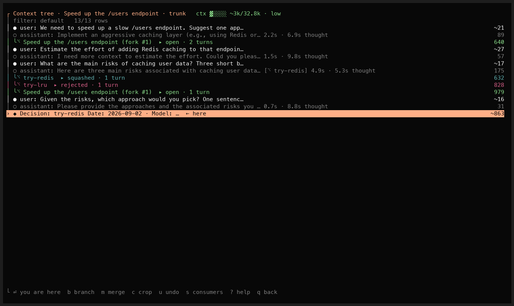
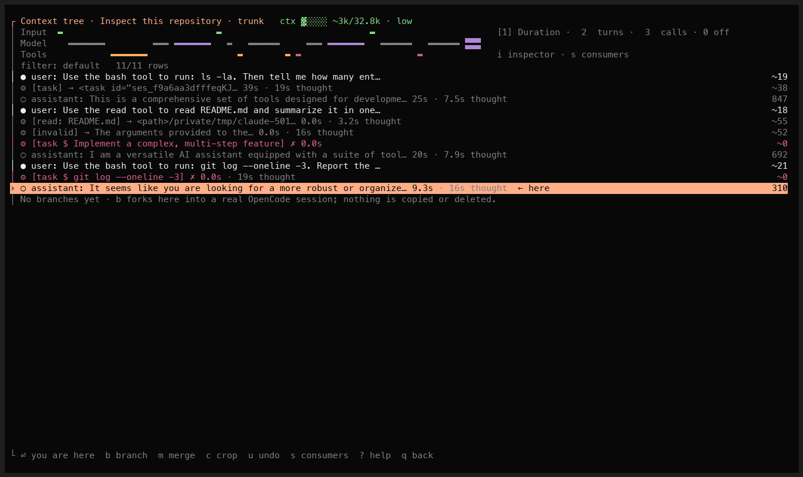
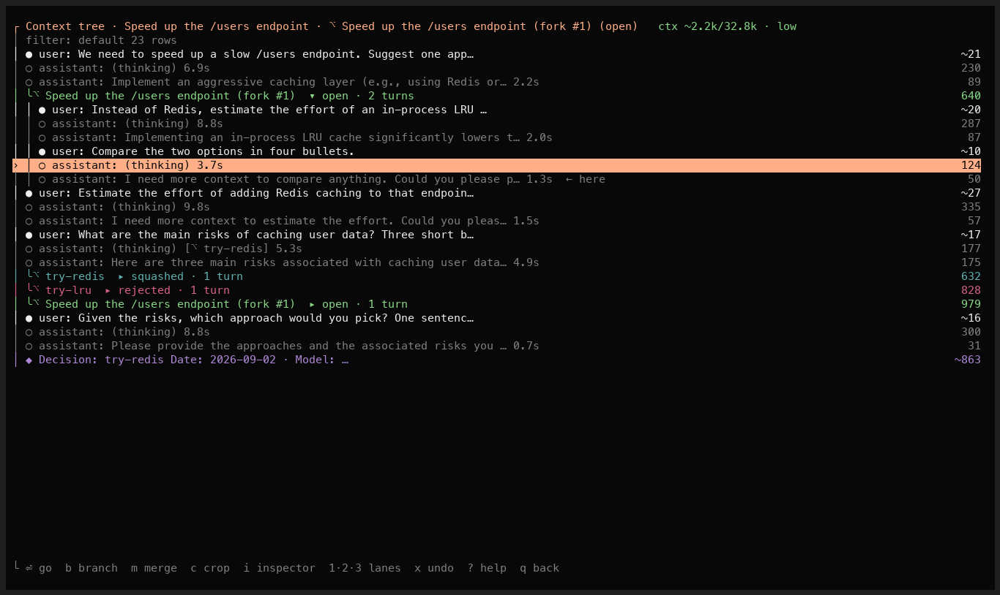
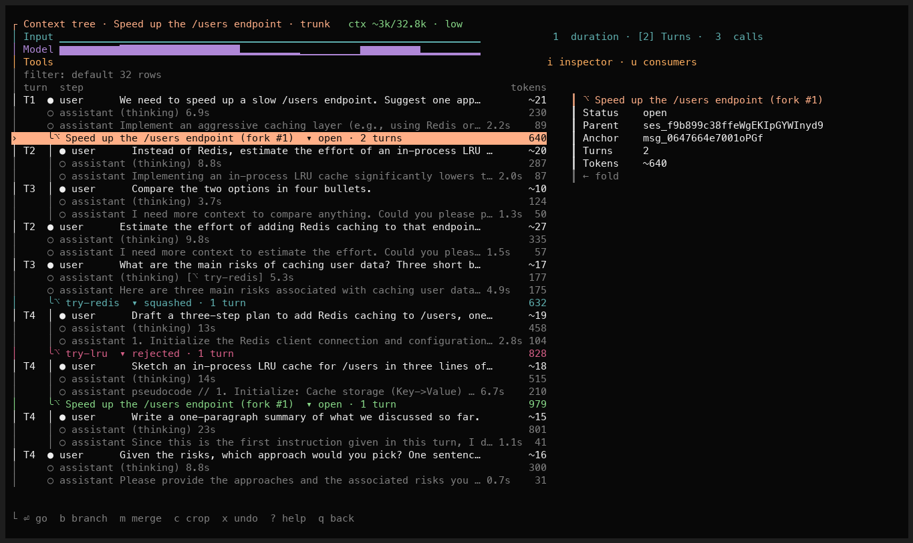
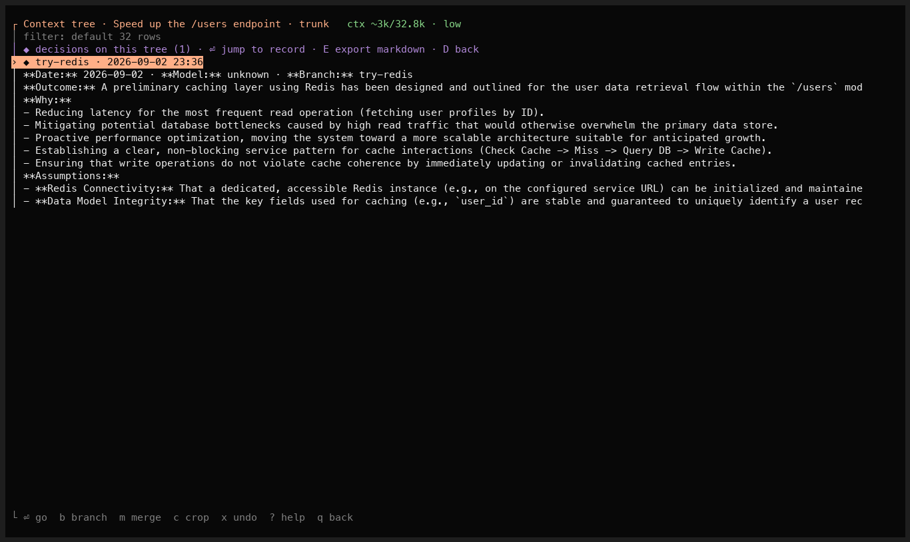
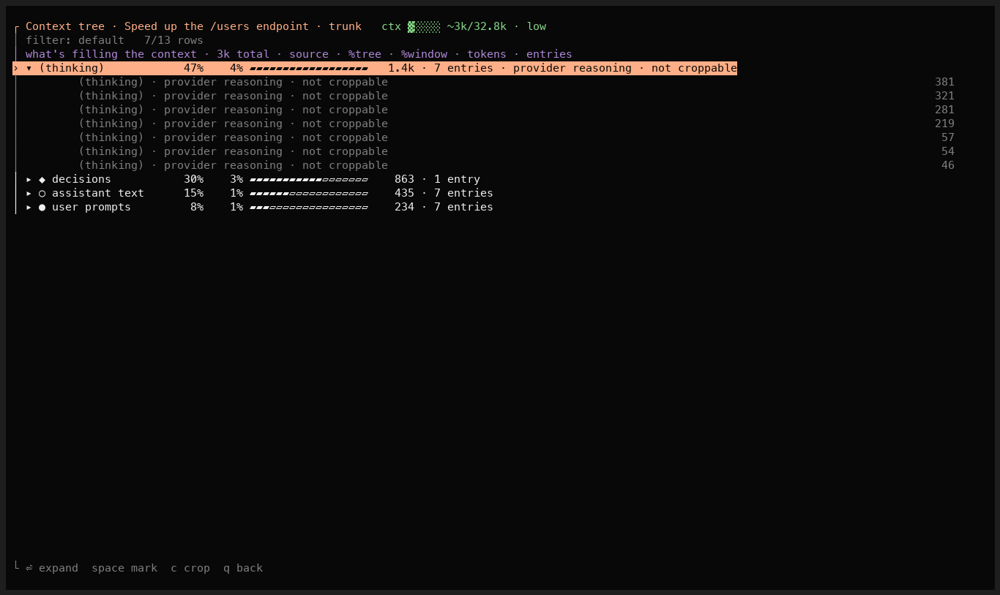
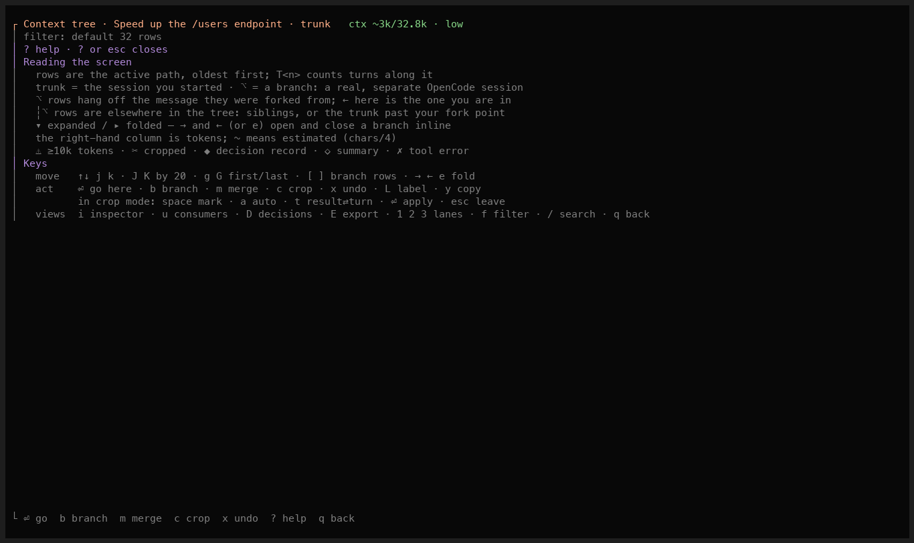
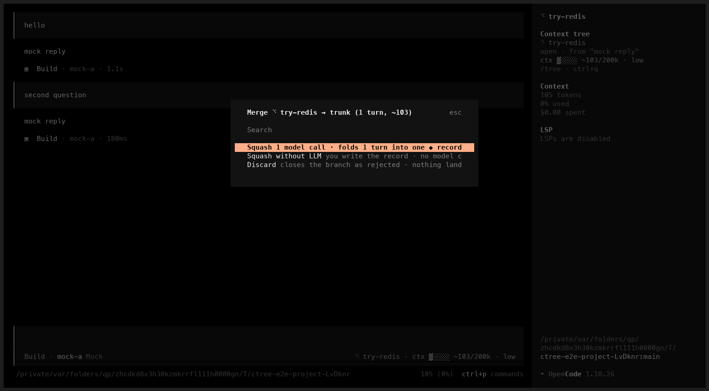
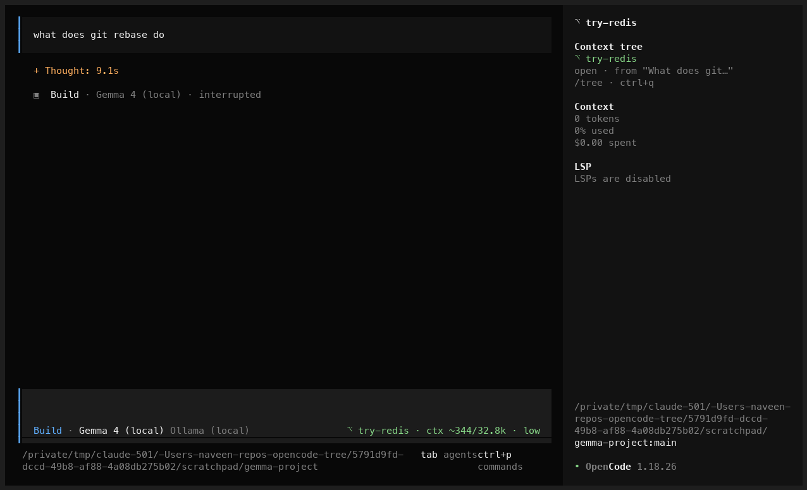

# opencode-context-tree

Pi-style context tree for [OpenCode](https://opencode.ai), with the
[`pi-context-tree`](https://github.com/navbytes/pi-context-tree) git-style workflow
(`/branch`, `/merge`, `/crop`, `/undo`) and a DeepSeek-Harness-style trajectory view
(timeline lanes, per-step tokens — the model's own where it reports them, estimated `~`
elsewhere — timing, inspector) in one screen.

**Status: 0.1.0 — first release. Install with `"plugin": ["opencode-context-tree"]` in both `opencode.json` and `tui.json` (see `docs/USAGE.md`).**
Branch, jump, labels, filters, search, crop + undo, squash/discard/tournament merge with a
`$EDITOR` gate, the timeline lanes, inspector and consumers views, the gauge, and the headless
`/ctree` commands all work against OpenCode 1.18 and are covered by pty-driven e2e tests
(`bun run test:e2e`). Read [DESIGN.md](./DESIGN.md) — it contains the research
(Pi, `pi-context-tree`, OpenCode plugin/SDK surface, existing plugins, DSH
trajectory), the end-user flows, the combined tree + trajectory mockup, the data
model, architecture, edge cases, and the roadmap.

## Install

Requires OpenCode 1.18 or newer. One command registers both halves of the plugin (the server
plugin in `opencode.json`, the TUI plugin in `tui.json`):

```sh
opencode plugin opencode-context-tree -g     # for every project (~/.config/opencode)
opencode plugin opencode-context-tree        # for the current project only (.opencode/)
```

Restart OpenCode. `/tree` (or `ctrl+q`) opens the tree; `/branch`, `/merge`, `/decisions` and the
headless `/ctree` commands are available too.

If you only see `/ctree` and no `/tree`, the TUI half is not registered: run the command above.
To register by hand instead, the package name must be listed in **both** files:

```jsonc
// opencode.json (or ~/.config/opencode/opencode.jsonc)
{ "plugin": ["opencode-context-tree"] }
// tui.json     (or ~/.config/opencode/tui.json)
{ "plugin": ["opencode-context-tree"] }
```

Options go in either file: `[["opencode-context-tree", { "storage": "global", "jumpSummary": "never" }]]`
(see [docs/USAGE.md](docs/USAGE.md)). To hack on it from a checkout, see "Try it from source" below.

## The idea in one screen

`/tree` is an outline of the whole session tree — Pi's tree — where every message and tool step
is one content-forward row and branches are drawn at their fork points:

```
┌ Context tree · Fix flaky test · trunk                                  ctx ~46k/200k · filling
│ filter: default 24 rows
│ ● user: build yourself a tool that reads the context window…                              ~1.2k
│ ○ assistant: I'll start by inspecting my environment…                                      0.3k
│ ⚙ [bash $ ls -la ~/Documents/] → total 744 …                                              ~2.1k
│ ● user: decompress the session and show the structure                                      ~0.2k
│ ╰⎇ try-redis  ▸ squashed · 9 turns                                                          ~22k
│ ╰⎇ fix-flaky  ▾ open · 6 turns  ← here                                                      ~14k
│ │ ● user: the bun test is flaky, find the race                                             ~0.4k
│ │ ⚙ [bash $ bun test src/foo.test.ts] ⚠                                                     ~4.7k
│ ◆ Decision: try-redis · Outcome: switched to a write-through cache…                         ~0.9k
└ ⏎ go  b branch  m merge  c crop  i inspector  1·2·3 lanes  x undo  ? help  q back
```

Every message and tool call is a row; the gutter draws each branch at the message it was forked
from; from anywhere you see the whole tree, your current branch open with `← here` and the rest
folded. It stays close to Pi so the screen is familiar to anyone coming from it. The DeepSeek
Harness *trajectory* is one keystroke away, not gone: `i` opens the inspector (per-step payload,
result, timing) and `1/2/3` bring in the Input / Model / Tools lane minimap. Sessions made with
OpenCode's own `/fork` are adopted into the tree automatically.

## Screenshots

Real OpenCode 1.18 TUI, gemma4 via ollama. `/tree` opens as a Pi-style outline of the whole
session tree: one content-forward row per message and tool step (`● user:` / `○ assistant:` /
`⚙ [bash $ …]`), branches drawn at their fork points with `│ ├ ╰` connectors and folded to their
`⎇` header until you open them. Here a trunk about caching a `/users` endpoint has a squashed
`try-redis` branch (its ◆ decision record is the leaf), a rejected `try-lru`, and two native
`/fork` sessions:



The DeepSeek-Harness trajectory is one keystroke away, not gone: `i` opens the inspector and
`1/2/3` bring in the Input/Model/Tools lanes:



From inside a branch, `← here` marks your current step, that branch is expanded, and the rest of
the tree stays visible and folded — you always see the whole tree:



`→` expands a branch inline (its turns continue the numbering from the fork point):



`D` decisions · `u` what's filling the context · `?` help · `m` merge · the sidebar card:

| | |
|---|---|
|  |  |
|  |  |



## Try it from source

```sh
bun install && bun run build
# opencode.json  →  "plugin": ["/abs/path/opencode-tree/dist/server.js"]
# tui.json       →  "plugin": ["/abs/path/opencode-tree/dist/tui.js"]
```

The footer inside `/tree` carries six keys — `⏎` go, `b` branch, `m` merge, `c` crop,
`x` undo, `q` back — and `?` opens a help overlay with the rest: crop mode (`space` mark,
double for protected, `a` auto, `t` result⇄turn, `⏎` apply), `i` inspector, `u` consumers,
`D` decisions (`E` export), `L` label, `←→` fold/unfold, `[ ]` hop branches, `f` filter,
`/` search, `g/G`, and how to read the screen.

## Commands

| Command | What it does |
|---|---|
| `/tree` (`Ctrl+Q`) | open the combined tree + trajectory view |
| `/branch <name> [model]` | fork here into a named branch, optionally on a cheaper model |
| `/merge [--pick \| --no-llm \| --discard \| --tournament]` | close the branch: **Squash** drafts a ◆ decision record you confirm, **Squash without LLM** lets you write it, **Discard** lands nothing, **Tournament** keeps one of several siblings. Your transcript is never rewritten; the record is appended to the trunk as a normal message |
| `/crop [--top \| --auto …]` | stub fat tool results or drop whole turns from what the model sees; append-only, reversible |
| `/undo` | revert the last branch / merge / crop |
| `/decisions [--export]` | list or export decision records |

## How it maps onto OpenCode

- a **branch is an OpenCode session** created with `session.fork`; the plugin
  remembers `(parent, anchor)` in an append-only journal and mirrors it into
  `session.metadata`;
- **crop** is applied per request in `experimental.chat.messages.transform`, so the
  transcript keeps the originals and the model sees stubs;
- **merge** writes the confirmed record with `session.prompt({ noReply: true })`;
- the UI is a TUI plugin (`@opencode-ai/plugin/tui`): a route, two slots (gauge,
  sidebar card), dialogs and a keymap layer.

